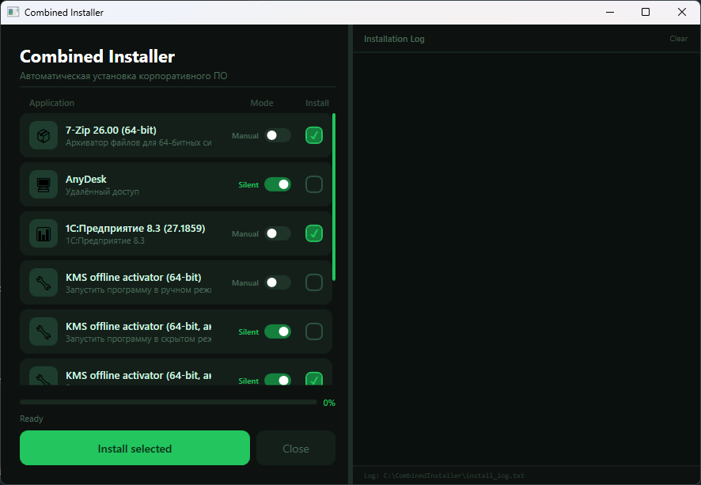
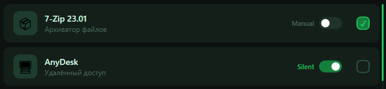

# Combined Installer
Корпоративный установщик ПО с GUI, прогресс-баром и загрузкой дистрибутивов с NAS/облака.


---

## Структура проекта

```
combined-installer/
├── CombinedInstaller.ps1 ← Главный скрипт
├── apps.json             ← Список приложений для установки
├── .env                  ← Секреты и настройки (НЕ коммитить!)
├── .env.example          ← Шаблон .env (коммитить)
├── .gitignore            ← Исключения Git
├── BUILD.bat             ← Сборка в EXE
└── README.md             ← Эта инструкция
```

> `.env` содержит чувствительные данные (адрес NAS, логин, пароль) и исключён из Git через `.gitignore`.  
> `apps.json` — публичный список приложений, его можно и нужно коммитить.

---

## Быстрый старт

```bash
# 1. Клонируй репозиторий
git clone https://github.com/you/combined-installer
cd combined-installer

# 2. Создай .env из шаблона и заполни
cp .env.example .env
notepad .env

# 3. Отредактируй список приложений
notepad apps.json

# 4. Собери EXE
BUILD.bat
```

---

## Шаг 1 — Настройка .env

Скопируй `.env.example` в `.env` и заполни переменные:

```ini
# Адрес NAS / облачного хранилища с дистрибутивами
NAS_BASE=https://your-nas.example.com/installers
# ИЛИ для локальной сети (SMB):
# NAS_BASE=\\192.168.1.100\installers

# Авторизация (оставь пустым если не нужна)
NAS_USER=
NAS_PASS=

# Временная папка и лог на целевой машине
TEMP_DIR=%TEMP%\CombinedInstaller
LOG_FILE=%TEMP%\CombinedInstaller\install_log.txt

# Заголовок окна
APP_TITLE=Combined Installer
APP_SUBTITLE=Автоматическая установка корпоративного ПО
APP_COMPANY=Your Company Name
APP_VERSION=1.0.0

# Исключения Windows Defender (через запятую, без пробелов)
DEFENDER_EXCLUDE_PATHS=C:\Program Files\1cv8,C:\Program Files (x86)\AnyDesk
DEFENDER_EXCLUDE_PROCESSES=1cv8.exe
```

---

## Шаг 2 — Настройка apps.json

Отредактируй `apps.json` — это обычный JSON-массив объектов. Каждый объект описывает одно приложение:

```json
[
  {
    "name": "Название программы",
    "file": "имя_файла.exe",
    "args": "/S",
    "silent": true,
    "icon": "📦",
    "desc": "Короткое описание"
  }
]
```

| Поле     | Обязательное | Описание |
|----------|:---:|---|
| `name`   | ✅ | Отображаемое название в GUI |
| `file`   | ✅ | Имя файла на NAS (относительно `NAS_BASE`) |
| `args`   | ✅ | Аргументы запуска установщика |
| `silent` | — | Режим по умолчанию: `true` — тихо (скрыто), `false` — вручную (с окном). Если не указано — `true` |
| `icon`   | — | Emoji-иконка (по умолчанию 📦) |
| `desc`   | — | Подпись под названием в GUI |

### Режим установки: выбор пользователем

На каждой карточке в GUI есть Toggle-переключатель. Пользователь кликает по нему и меняет режим перед запуском:



- **Тихо** (переключатель вправо, синий) — установщик запускается скрыто в фоне. Подходит для большинства программ.
- **Вручную** (переключатель влево, серый) — окно установщика открывается на экране, пользователь проходит шаги сам. Удобно для программ с лицензионным ключом или нестандартными опциями.

Поле `"silent"` в `apps.json` задаёт только **состояние переключателя по умолчанию** — пользователь всегда может изменить его перед запуском.

### Ключи тихой установки

| Тип установщика | Ключи для `args` |
|-----------------|-----------------|
| NSIS `.exe`     | `/S` |
| Inno Setup      | `/VERYSILENT /SUPPRESSMSGBOXES` |
| MSI             | `/quiet /norestart` |
| 7-Zip           | `/S` |
| AnyDesk         | `--install "C:\путь" --start-with-windows` |
| 1С 8.3          | `/S` |
| Office ODT      | `/configure configuration.xml` |

> При режиме «Вручную» поле `args` можно оставить пустым — установщик откроется как обычно.

### Пример добавления новой программы

```json
{
  "name": "Telegram",
  "file": "tsetup.exe",
  "args": "/S",
  "silent": true,
  "icon": "💬",
  "desc": "Мессенджер"
}
```

Просто добавь объект в массив — скрипт подхватит автоматически.

---

## Шаг 3 — Подготовка NAS хранилища

Положи все дистрибутивы в одну папку на NAS, имена должны совпадать с полем `file` в `apps.json`:

```
installers/
├── 7z2301-x64.exe
├── AnyDesk.exe
├── 1cv8setup.exe
├── office_setup.exe
├── configuration.xml     ← для Office ODT
├── util1_setup.exe
└── util2_setup.exe
```

Если NAS требует авторизацию — укажи `NAS_USER` и `NAS_PASS` в `.env`.

---

## Шаг 4 — Сборка EXE

Запусти `BUILD.bat` от имени администратора — он сам установит `ps2exe` если нужно и соберёт `CombinedInstaller.exe`.

Или вручную:

```powershell
Install-Module ps2exe -Scope CurrentUser -Force
Invoke-ps2exe -InputFile CombinedInstaller.ps1 -OutputFile CombinedInstaller.exe -RequireAdmin
```

> После сборки `.env` и `apps.json` должны лежать **рядом с EXE** на целевой машине.

---

## Что делает установщик при запуске

1. Запрашивает права администратора (UAC) автоматически
2. Читает `.env` и `apps.json` из своей папки
3. Добавляет исключения в Windows Defender (до скачивания)
4. Скачивает только отмеченные пользователем приложения
5. Устанавливает по очереди — в режиме выбранном пользователем в GUI (тихо или вручную)
6. Ведёт лог в `%TEMP%\CombinedInstaller\install_log.txt`
7. Очищает временные файлы после завершения

---

## Подпись EXE (рекомендуется)

Без подписи Windows SmartScreen может заблокировать запуск на новых машинах. Чтобы этого избежать:

```powershell
# Через PowerShell (если есть Code Signing сертификат):
$cert = Get-ChildItem Cert:\CurrentUser\My -CodeSigningCert | Select-Object -First 1
Set-AuthenticodeSignature -FilePath CombinedInstaller.exe -Certificate $cert

# Через signtool (из Windows SDK):
signtool sign /a /fd SHA256 /tr http://timestamp.digicert.com /td SHA256 CombinedInstaller.exe
```

---

## Распространение через GPO

Чтобы EXE не блокировался ни на одной машине домена:

1. Открой `Group Policy Management`
2. Создай политику: `Computer Configuration → Windows Settings → Security Settings → Software Restriction Policies`
3. Добавь путь к EXE в **Trusted Publishers** или **Additional Rules**

### Debugging
[ ] - выборочная загрузка не работает, загружает все файлы.